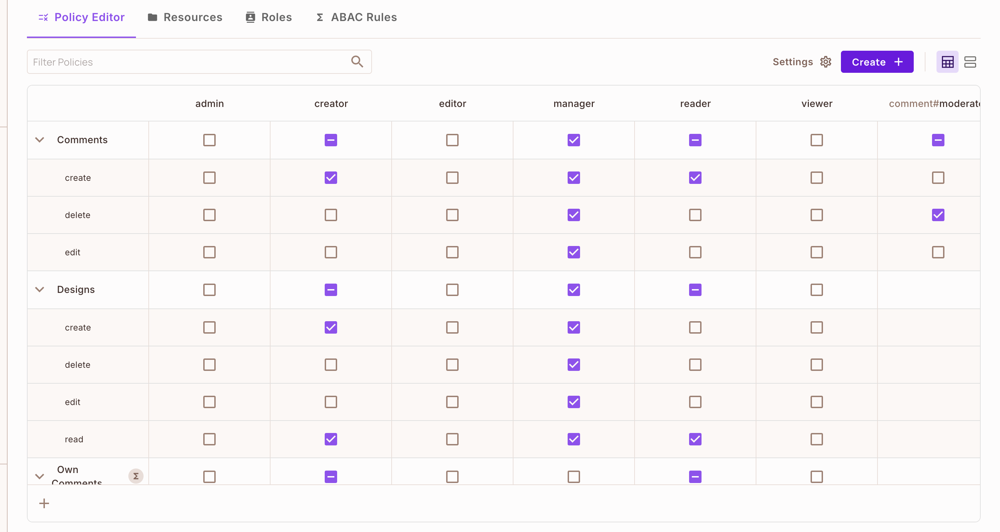
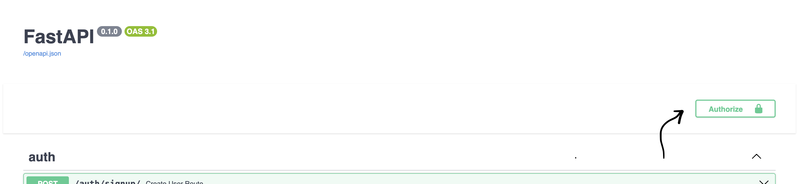

# Permit Python With FastAPI Example

The app demonstrate a design collaboration app
for users to share designs(like figma) and comment on them. the app policy will be enforce by permit. there are 3 types of users.
reader, editor, and manager.

- **Reader** can only view design and comments on design, he can delete and edit his own comments.
- **Creator** can create and edit,delete his own designs ,but not others users, he can comment on his design. and other design but can only delete his own comments.
- **Manager** allow to create, edit, delete designs and comments of other users.

The app enable to signup a user, and expose route to sync user to permit system to 
set his authority 


## Machine Prerequisities
- python^3.10 [python install](https://www.python.org/downloads/)
- pip (or any package installer you prefer) [pip install](https://pip.pypa.io/en/stable/cli/pip_install/)
- terraform cli [terraform install](https://developer.hashicorp.com/terraform/tutorials/aws-get-started/install-cli)
- docker [docker install](https://docs.docker.com/engine/install/)
- docker-compose [docker-compose install](https://docs.docker.com/compose/install/)

## Permit Prerequisities
- Signup to permit.io create your first project and grab your **api key** 
 
### Ok, lets start with the fun 🐶

## Setup
### Set App Permit Policy Using permit-terraform-provider
- load env variables to the shell

  ``` export TF_VAR_permit_api_key=<PERMIT_API_KEY> ```

- Applying the terraform plan
  ```
  cd terraform && terraform init && terraform plan && terraform apply -auto-approve
  ```

go to your project dashboard you should see your policies resources and roles.


### Launch the FastAPI app

- Create .env file(look at .env.dev) and paste the api key to the .env file 
  ```
  PERMIT_API_KEY=<API_KEY_HERE>
  CONNECTION_STRING=<CONNECTION_STRING>
  ```

  for example 
  ```
  PERMIT_API_KEY=permit_key_xxxxxx
  CONNECTION_STRING=postgresql+asyncpg://postgres:postgres@db/design_app_db
  ```
 - run ``` docker-compose up -d ``` (deploy the pdp, the db ,and the app)

 ## Use The App
 Now it all setup to use our design app!

 open [swagger](http://127.0.0.1:8000/docs)

 - Signup a new user with the email **reader@gmail.com** using the [sign up request](http://127.0.0.1:8000/docs#/auth/create_user_route_auth_signup__post)

  - You can see the user you created in the permit dashboard on the directory page under * All Tenants

 - Assign **reader** role to the user using [assigned role request](http://127.0.0.1:8000/docs#/auth/assigned_role_to_user_auth_assign_role_post)

- paste it in the body request
   ```
  {   
    "user":"reader@gmail.com",
    "role": "reader"
  }
    ```

 ### Lets try to create new design when we signed as reader 
 - Signin (In the swagger page press on the authorized button and paste the user email)
 
 - Try to create design using the [create design request](http://127.0.0.1:8000/docs#/design/create_design_design_post)
 #### We get an 403 status with the message Not authorized 🔒

## RBAC Case
 ### Now Lets create new user but now with **creator** permissions

  - Signup a new user with the email **creator@gmail.com** using the [sign up request](http://127.0.0.1:8000/docs#/auth/create_user_route_auth_signup__post)

 - Assign **creator** role to the user using [assigned role request](http://127.0.0.1:8000/docs#/auth/assigned_role_to_user_auth_assign_role_post)
    
- paste it to the request body 
   ```
  {   
    "user":"creator@gmail.com",
    "role": "creator"
  }
    ```

 ### Lets try to create new design when we signed as creator 
 - Signin (In the swagger page press on the authorized button and paste the user email)
 - Try to create design using the [create design request](http://127.0.0.1:8000/docs#/design/create_design_design_post)
 - The design should be created (check on your db)

 - Now [Lets comment on the design](http://localhost:8000/docs#/comment/create_comment_comment_post) with creator user

 ## ABAC case 
 - [Delete the comment the creator](http://localhost:8000/docs#/comment/delete_comment_comment__comment_id__delete) just commented  

 ## ReBAC case 
 - Lets [delete the design of the creator](http://localhost:8000/docs#/comment/delete_comment_comment__comment_id__delete) just commented  
 


    

