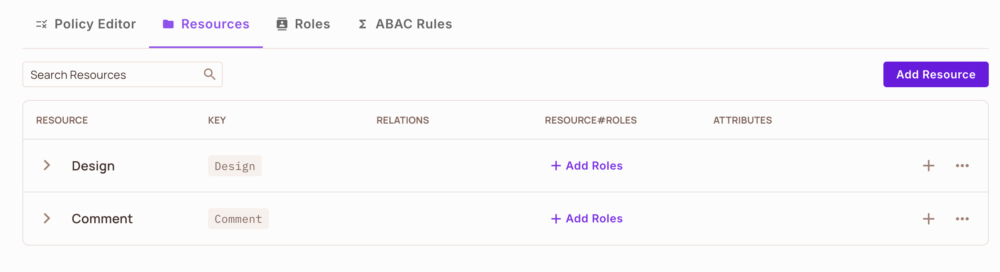
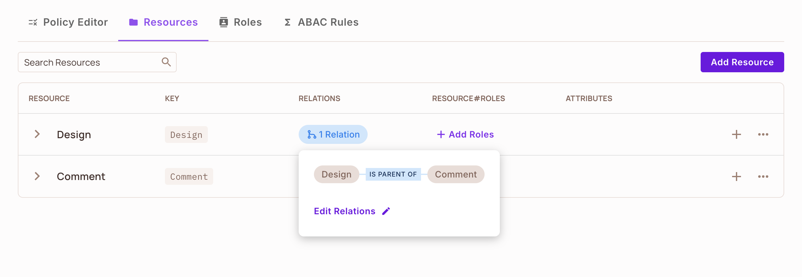

# Terraform ReBAC Recipe

ReBAC may seem to you little bit complex... and you are right, its complex. so here a simple recipe to create your reBAC rules using terraform in 5 minute

## 1. Create Resources

```
resource "permitio_resource" "design" {
  key         = "design"
  name        = "Designs"
  description = "A ui design"
  actions     = {
    "create" = { 
        "name" = "create",
        "description" = "create a design"
    },
    "read" = {
        "name" = "read",
        "description" = "read a design",
    },
    "edit" = {
        "name" = "edit",
        "description" = "edit a design"
    },
    "delete" = {
        "name" = "delete",
        "description" = "delete a design",
    }
  }
  attributes = {
    "creator" = {
        "description" = "The user who created the design"
        "type" = "string"
    }
  }
}

resource "permitio_resource" "comment" {
  key     = "comment"
  name    = "Comments"
  actions = {
    "create" = { "name" = "create" }
    "edit" = { "name" = "edit" }
    "delete" = { "name" = "delete" }
  }
  attributes = {
    "author" = {
      "description" = "The user key who created the comment",
      "type"        = "string"
    }
  }
}
```

In your enviornment you see your created resources

 

 ## 2. Create resource relationships

 ```
resource "permitio_relation" "design_comment_relation" {
  key              = "parent"
  name             = "Design parent of Comment"
  subject_resource = permitio_resource.design.key
  object_resource  = permitio_resource.comment.key
  depends_on       = [
    permitio_resource.design,
    permitio_resource.comment,
  ]
}
 ```

  

   ## 3. Adding roles to resources

   ```
resource "permitio_role" "design_creator" {
  key         = "creator"
  name        = "creator"
  description = "edit and delete own designs"
  resource    = permitio_resource.design.key
  permissions = ["edit", "delete"]
  depends_on  = [
    permitio_resource.design
  ]
}

resource "permitio_role" "comment_moderator" {
  key         = "moderator"
  name        = "moderator"
  description = "Delete comments on own designs"
  resource    = permitio_resource.comment.key
  permissions = ["delete"]
  depends_on  = [
    permitio_resource.comment
  ]
}

   ```

   ## 4. Defining role derivations

   ```
  resource "permitio_role_derivation" "design_creator_comment_moderator" 
  {
  role        = permitio_role.design_creator.key
  on_resource = permitio_resource.design.key
  resource    = permitio_resource.comment.key
  to_role     = permitio_role.comment_moderator.key
  linked_by   = permitio_relation.design_comment_relation.key
  depends_on  = [
    permitio_resource.design,
    permitio_resource.comment,
    permitio_role.comment_moderator,
    permitio_role.design_creator,
    permitio_relation.design_comment_relation,
  ]
    }

   ```


   ### Wrap up
   #### At this point we create 2 resources (design and comment) create a  relation between them that called "parent" , add roles to each resource, (for resource design we add the role "design_creator" and for the comment resource we add the role "comment moderator"), then we create derivations between the resources and the rules that was specified to each one. the derviation said that if user has permission as "design_creator" (can edit and delete designs)  then he implicitly get the rule "comment_moderator" which enable him to delete comments that belong to his designs.

   #### The 3 last steps should be implemented in your code base or in permit ui dashboard  - 5,6 steps create the actual user and resource items of your system (facts) and 7 step is the permission check which return the result if your user(or any identity) can perform the action he desired on the resource.

   ## 5. Creating a resource instance

   ## 6. Assigning resource instances to a user

   ## 7. Enforcing your policies in your code
